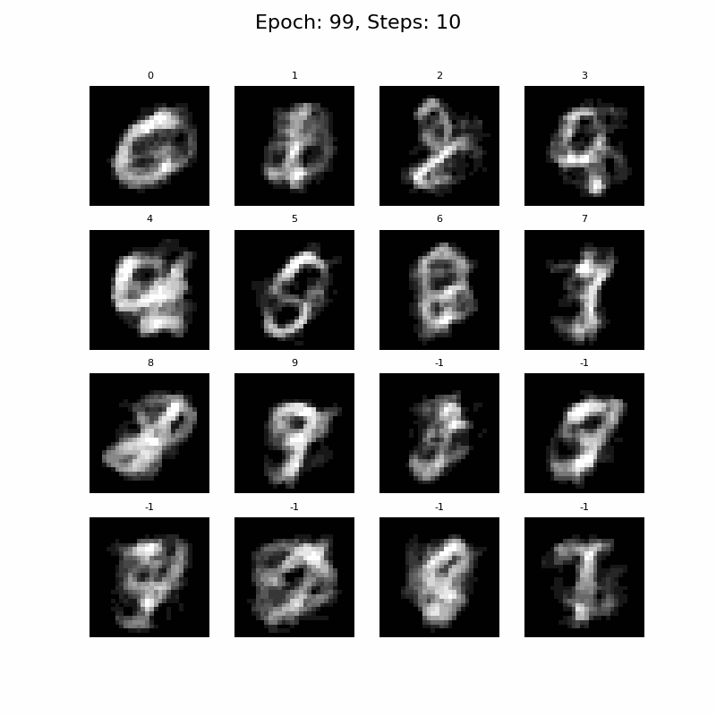
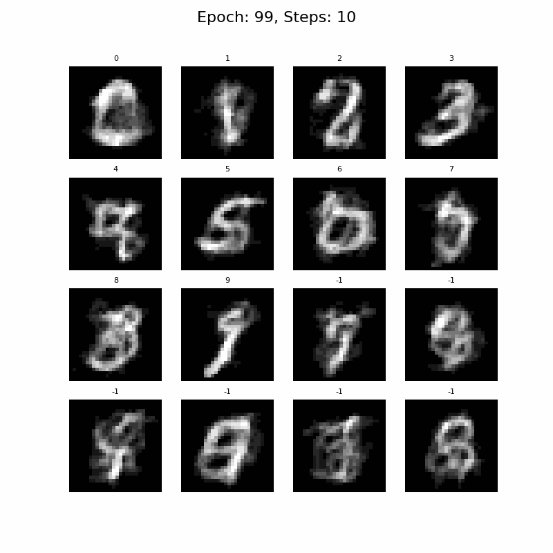

# consistency-mnist

A simple consistency model for MNIST.
This is the 'Consistency Training (CT)' variant, where the training target is an EMA of the training model.
It's a very minimal approach based off of the [official repository](https://github.com/openai/consistency_models)
and the [paper](https://arxiv.org/abs/2303.01469).
Note, there are some minor differences between the paper and official implementation.

The model can be trained with the command, MNIST will download automatically:

```terminal
python train.py -ckpt CHECKPOINTING_PATH -d MNIST_DOWNLOAD_PATH
```

A small U-Net has been used for de-noising since is the de-facto model for image generation at the moment.
The U-Net is likely overkill for this task, a smaller network may produce similar results.

<p align="center">
  
  <br>Generation after 100 epochs of training, using 10 iteration steps with different noise added each iteration.
</p>

One of the properties of 'self-consistency' mentioned in the paper is that generations from the same trajectory
should produce the same result.
The sampling can be changed to show this, simply pass `z = x_init / ts[0]` into the sampling method.
Results will look more similar to this:

<p align="center">
  
  <br>Generation after 100 epochs of training, using 10 iteration steps with the same noise added each iteration.
</p>
 


